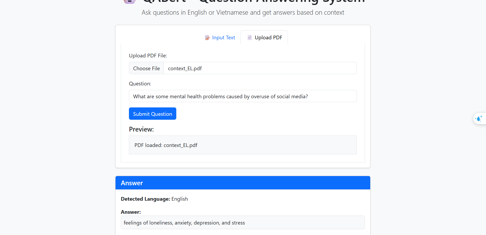
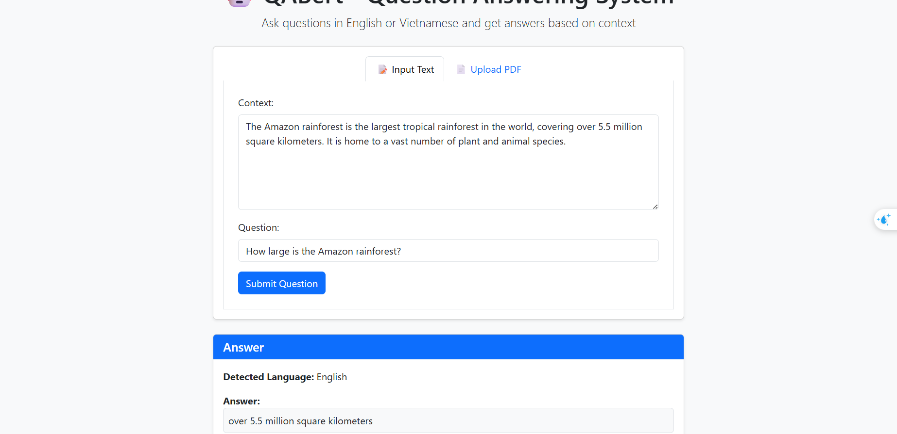

# QABert - Question Answering System with BERT and viBERT

This project demonstrates an intelligent Question Answering (Q&A) system that automatically detects the language of your context and selects the appropriate model:

- **English Q&A** using BERT with SQuAD dataset.
- **Vietnamese Q&A** using viBERT with UIT-ViQuAD2.0 dataset.

## Features

- **Automatic language detection** using NLTK
- **Support for both text and PDF inputs**
- **Web interface** built with Flask
- **History tracking** of all questions and answers
- **Confidence score** for each answer

## Models

### PDF File



- Model: BERT
- Dataset: [SQuAD](https://drive.google.com/file/d/10II700yrTxOMIInqSUXWRWwHc9pLK-hW/view?usp=sharing)

### Vietnamese & English Model



- Model: viBERT
- Dataset: [UIT-ViQuAD2.0](https://drive.google.com/file/d/1n0lA92OnnvAArWLptz_5ejIsMY4tjedQ/view?usp=sharing)

## Installation

1. Install the required dependencies:

```bash
pip install -r requirements.txt
```

2. Set up the NLTK resources:

```bash
python setup.py
```

## Run the App

To launch the Flask app:

```bash
python app.py
```

Alternatively, you can use the provided batch file:

```bash
run.bat
```

Then open http://127.0.0.1:5000 in your browser.

## How It Works

1. **Input**: Enter your context text or upload a PDF document
2. **Language Detection**: The system automatically detects if the text is in English or Vietnamese
3. **Model Selection**: Based on the detected language, the appropriate BERT model is selected
4. **Question Processing**: Your question is processed against the context using the selected model
5. **Answer**: The system returns the answer with a confidence score