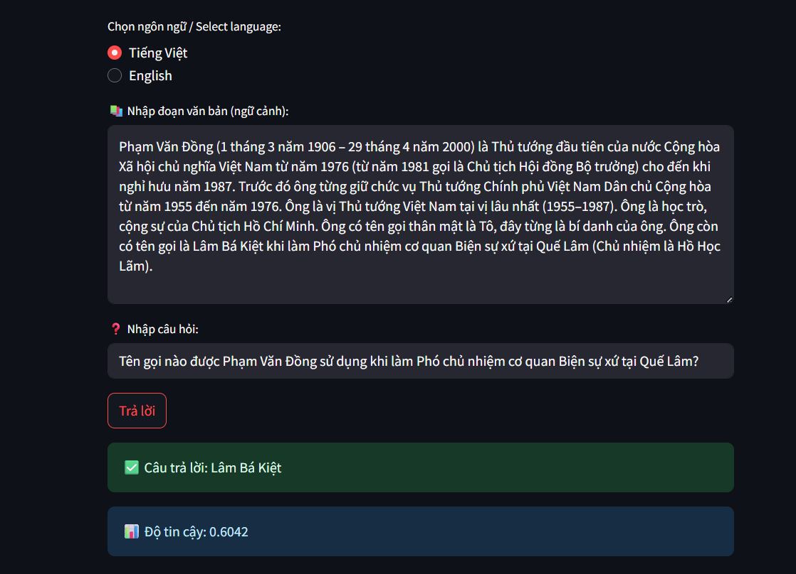

# Q&A Models with BERT and viBERT

This project demonstrates two Question Answering (Q&A) models:

- **English Q&A** using BERT with SQuAD dataset.
- **Vietnamese Q&A** using viBERT with UIT-ViQuAD2.0 dataset.

## Models

### English Model


- Model: BERT
- Dataset: [SQuAD](https://drive.google.com/file/d/10II700yrTxOMIInqSUXWRWwHc9pLK-hW/view?usp=sharing)

### Vietnamese Model



- Model: viBERT
- Dataset: [UIT-ViQuAD2.0](https://drive.google.com/file/d/1n0lA92OnnvAArWLptz_5ejIsMY4tjedQ/view?usp=sharing)

## Run the App

To launch the Streamlit app:

```bash
streamlit run app.py
